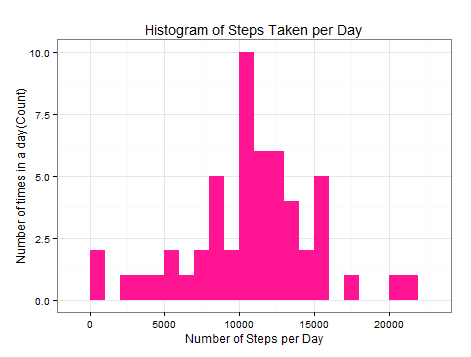
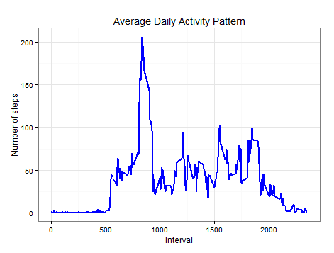
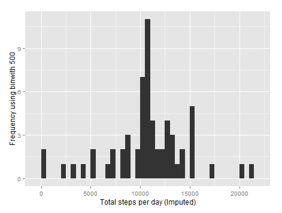
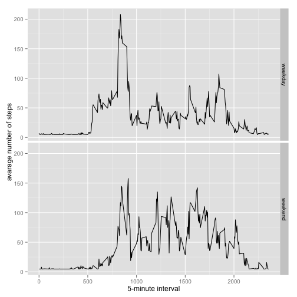

# Reproducible Research: Peer Assessment 1

## Loading and preprocessing the data
##### 1. Load the data (i.e. read.csv())

```r
if(!file.exists('activity.csv')){
    unzip('activity.zip')
}
MyData <- read.csv('activity.csv', header = TRUE, sep = ",",
+                   colClasses=c("numeric", "character", "numeric"))
```
##### 2. Process/transform the data (if necessary) into a format suitable for your analysis

```r
MyData$date <- as.Date(MyData$date, format = "%Y-%m-%d")
MyData$interval <- as.factor(MyData$interval)
```

-----

## What is mean total number of steps taken per day?

```r
steps_per_day <- aggregate(steps ~ date, MyData, sum)
colnames(steps_per_day) <- c("date","steps")
head(steps_per_day)
```

##### 1. Make a histogram of the total number of steps taken each day

```r
ggplot(steps_per_day, aes(x = steps)) + 
+     geom_histogram(fill = "deeppink", binwidth = 1000) + 
+     labs(title="Histogram of Steps Taken per Day", 
+          x = "Number of Steps per Day", y = "Number of times in a day(Count)") + theme_bw()  
```

 

##### 2. Calculate and report the mean and median total number of steps taken per day

```r
stepsByDayMean   <- mean(steps_per_day$steps, na.rm=TRUE)
stepsByDayMean
stepsByDayMedian <- median(steps_per_day$steps, na.rm=TRUE)
stepsByDayMedian
```
* Mean: 9354.23
* Median:  10395

-----

## What is the average daily activity pattern?
#Calculate Steps per Interval and save in a data frame called steps_per_interval
```r
steps_per_interval <- aggregate(MyData$steps, 
+                                 by = list(interval = MyData$interval),
+                                 FUN=mean, na.rm=TRUE)
```
#Convert the intervals as integers 
```r
steps_per_interval$interval <- 
        as.integer(levels(steps_per_interval$interval)[steps_per_interval$interval])
colnames(steps_per_interval) <- c("interval", "steps")
```
##### 1. Make a time series plot

```r
ggplot(steps_per_interval, aes(x=interval, y=steps)) +   
+     geom_line(color="blue", size=1) +  
+     labs(title="Average Daily Activity Pattern", x="Interval", y="Number of steps") +  
+     theme_bw()
```

 

##### 2. Which 5-minute interval, on average across all the days in the dataset, contains the maximum number of steps?

```r
max_interval <- steps_per_interval[which.max(  
+     steps_per_interval$steps),]
max_interval
```

* The 835th interval has maximum 206 steps.

----

## Imputing missing values
##### 1. Calculate and report the total number of missing values in the dataset 

```r
missing_vals <- sum(is.na(MyData$steps))
missing_vals
```

* Number of missing values: 2304

##### 2. Devise a strategy for filling in all of the missing values in the dataset.
##### 3. Create a new dataset that is equal to the original dataset but with the missing data filled in.

```r
stepValues <- data.frame(MyData$steps)
stepValues[is.na(stepValues),] <- ceiling(tapply(X=MyData$steps,INDEX=MyData$interval,FUN=mean,na.rm=TRUE))
newData <- cbind(stepValues, MyData[,2:3])
colnames(newData) <- c("Steps", "Date", "Interval")
View(newData)
```


##### 4. Make a histogram of the total number of steps taken each day 

```r
stepsByDayImputed <- tapply(newData$Steps, newData$Date, sum)
qplot(stepsByDayImputed, xlab='Total steps per day (Imputed)', ylab='Frequency using binwith 500', binwidth=500)
```

 

##### ... and Calculate and report the mean and median total number of steps taken per day. 

```r
stepsByDayMeanImputed <- mean(stepsByDayImputed)
stepsByDayMeanImputed

stepsByDayMedianImputed <- median(stepsByDayImputed)
stepsByDayMedianImputed
```
* Mean (Imputed): 10784.92
* Median (Imputed):  10909


----

## Are there differences in activity patterns between weekdays and weekends?
##### 1. Create a new factor variable in the dataset with two levels - "weekday" and "weekend" indicating whether a given date is a weekday or weekend day.


```r
 newData$dateType <-  ifelse(as.POSIXlt(newData$Date)$wday %in% c(0,6), 'weekend', 'weekday')
```

##### 2. Make a panel plot containing a time series plot


```r
averagedActivityDataImputed <- aggregate(Steps ~ Interval + dateType, data=newData, mean)
ggplot(averagedMyDataImputed, aes(interval, steps)) + 
    geom_line() + 
    facet_grid(dateType ~ .) +
    xlab("5-minute interval") + 
    ylab("avarage number of steps")
```

 
